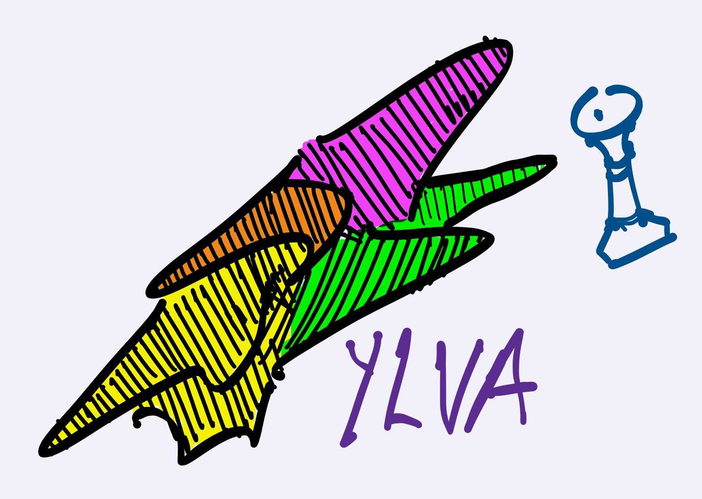

# YLVA

    

Welcome to *Ylva*, a minimal chess engine in the terminal. 

Ylva will see improvements over time.

**Not** UCI compliant. (*This is being worked on*)

Run using `run.sh`. This brings up a menu, with options to play with a friend, with the engine, engine v engine, or run Perft.
 
Current move generation speed is `~1million` nodes/second.

## Notable techniques

### Move generation

Ylva uses bitboards as the data structure that stores information about a board state. 

Bitboards are great because when used right, they speed up move generation significantly, because most operations required during move generation are reduced to bitwise operations. 12 bitboards are used for each of the 6 chess pieces, for each colour. The bitboards are also used to quickly get information such as whether certain squares are occupied (`set_bit(sq) & all_pieces`) , whether king is in check (`checkers != 0`).

Slider piece move generation is really costly, and various techniques such as [magic bitboards](https://www.chessprogramming.org/Magic_Bitboards) exist to speed up slider piece move generation. This implementation uses the [classical approach](https://www.chessprogramming.org/Classical_Approach) as it was the easiest to implement as a starting point.

### Evaluation

The engine favours positions where the side to move has a material gain after the move is made. A PSQT score for white and black is kept for each position that is reached, which is also considered in the evaluation. This allows Ylva to favour positions where pieces are placed in more natural squares.

### Search 

- Move ordering: Alpha beta pruning works best when it starts by searching good moves first, because then it can prune more branches. We don't know exactly what the good moves are of course, but we can guess what moves are better to start with. For instance: moves capturing high value pieces with lower value ones, promotion moves, and moves avoiding squares attacked by opponent pawns are often good. The score and pick approach is used, as explained [here](https://rustic-chess.org/search/ordering/how.html).

- Piece square tables: A rudimentary nudge given to the engine to tell it which squares are often good for certain pieces. I used the values explained [here](https://www.chessprogramming.org/Simplified_Evaluation_Function). Since these tables are symmetric between the d and e files, only half the values are stored, and the square index is manipulated to be able to index a 32 element array. 

- [Quiescence search](https://www.chessprogramming.org/Quiescence_Search): Statically evaluating positions when depth == 0 is dangerous because if you capture a pawn with your queen on the next move, the evaluation will think this is a good move, but what if the move after that caputres the queen? Then you have actually blundered your queen. So at depth 0, we start a new search, which looks only at capture moves, and the final positions that get evaluated have no captures available.

## UCI
The following UCI commands have been implemented:

## Todos

[Future plans for Ylva](https://github.com/IlanIwumbwe/Ylva/issues/2)

## Acknowledgements
Huge thanks to the resources I have used so far while developing this engine!

- Richard Allbert's, [Vice series](https://bit.ly/3XpdiKU) on his Bluefever Software channel. I followed the same approach as in this series for my PV table, checking for stop conditions during search, and stopping the search when the "stop" command is received from UCI GUI.
- Marcel Vanthoor's [Rustic chess engine](https://rustic-chess.org)
- [Chess Programming Wiki](https://www.chessprogramming.org)
- Sebastian Lague's [video](https://www.youtube.com/watch?v=U4ogK0MIzqk), which was also the original inspiration for Ylva.
- Oliver Brausch's [Olithink](https://github.com/olithink), specifically his method for peeking std input to check for "stop" command interrupting engine search
- [Roelof Berkepeis](https://github.com/tissatussa), providing many useful pieces of information and advice. 

## License
MIT
