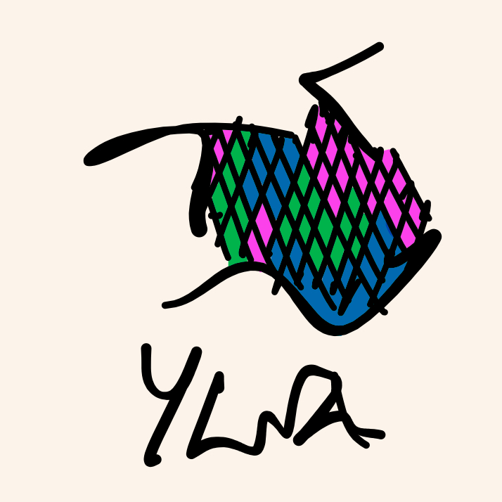

# ylva.c

    

A simple chess engine in C for educational purposes.

This is a rewrite of an older version that was in C++. A few features are missing and some stuff needs to be fixed as shown in Todos. These will be worked on subject to time constraints.

## Supported UCI commands
- `go` : `wtime`, `btime`, `winc`, `binc`, `movestogo`, `movetime`, `depth`
- `position`: all arguments
- `uci`
- `isready`

## Other commands
- `perft n` will count nodes to depth n

## Todos
- [x] Complete writing move ordering 
- [ ] Add killer move heuristic
- [ ] Add PSQT evaluation

## Acknowledgements

- Richard Allbert's, [Vice series](https://bit.ly/3XpdiKU) on his Bluefever Software channel
- Marcel Vanthoor's [Rustic chess engine](https://rustic-chess.org)
- The [Weiss](https://github.com/TerjeKir/weiss) engine
- [Chess Programming Wiki](https://www.chessprogramming.org)
- Oliver Brausch's [Olithink](https://github.com/olithink), specifically his method for peeking std input to check for "stop" command interrupting engine search
- [Analog Hors'](https://analog-hors.github.io/site/magic-bitboards/) explanation of magic bitboards
- [Tord Romstard's](https://www.chessprogramming.org/Looking_for_Magics) source code for finding magic numbers
- Sebastian Lague's [video](https://www.youtube.com/watch?v=U4ogK0MIzqk), which was also the original inspiration for Ylva.

## License
MIT
